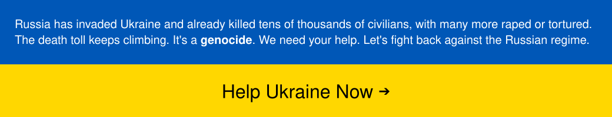

# EuropeanValues
EuropeanValues is a political quiz based on <a href="https://bannnedb.github.io/AmericanValues-2/">AmericanValues 2</a> (which is based on <a href="https://8values.github.io/">8values</a>), but tailored specifically to the political climate, treaties, and socio-economic systems of Europe. You will be presented with a statement, and you will answer with your opinion from <b>Strongly Agree</b> to <b>Strongly Disagree</b>, with each answer slightly affecting your scores.
